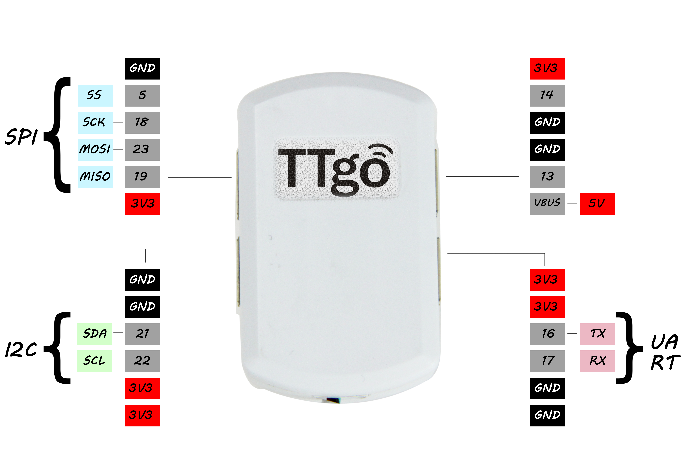
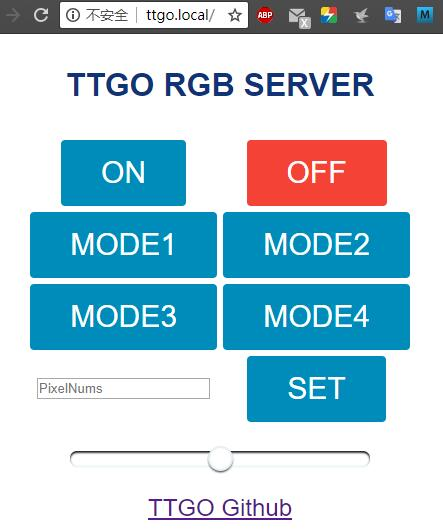

# TTGO RGB Web Server Example

The project needs to rely on the following libraries:
- [Adafruit_NeoPixel](https://github.com/adafruit/Adafruit_NeoPixel)
- [AsyncTCP](https://github.com/me-no-dev/AsyncTCP)
- [ESPAsyncWebServer](https://github.com/me-no-dev/ESPAsyncWebServer)

# How to use ?
- Default RGB DIO uses `13` Pin (Picture right upper jack)
- Use Arduino ESP32 Sketch data Upload files,if you not install,[download ESP32FS-vX.zip](https://github.com/me-no-dev/arduino-esp32fs-plugin/releases),Extract to <C:\Users\Your User Name\Documents\Arduino\tools>,Open Ardunio IDE,  Tools -> ESP32 Sketch data Upload -> Upload
- First time use your need configure WiFi SSID and password by IOTespressif App
after than,you can then enter http://ttgo.local in your browser or enter the IP address to access it.

# The webpage provides:
- On/Off
- Four modes (form Adafruit_NeoPixel examples)
- Brightness adjustment
- Pixels number changes

# Important:
If too many Pixels will trigger a low voltage detector, ESP32 will automatically reset. If you need to connect a lot of Pixels, you should provide a stable power supply.Limit the number to 999 in the program, you can change this value if needed.

